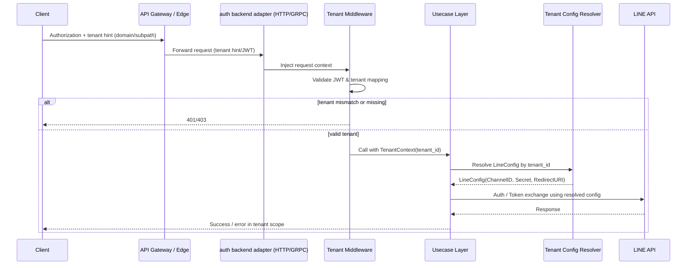

# base/auth LINE マルチテナント設計メモ

旧 auth/line をマルチテナント化する際に、テナント境界をどこで決めて、どこで漏れを防ぐかを図にした設計メモ。domain/usecase/adapter/infra の責務分離は既存 DDD ルールに従う。

## 前提とポリシー
- テナントごとに LINE の Channel ID/Secret/Redirect URI を変える。
- env の読み取りは cmd/infra まで。domain/usecase には `TenantContext` と `LineConfig` を渡すだけで、env 依存を隠蔽する。
- 「クライアントが送ってきた tenant_id」を鵜呑みにせず、JWT クレームやドメイン・サブパスと突き合わせて検証する。
- DB/外部 API へのアクセスは必ず tenant スコープ付きで実行し、漏れを防ぐ。

## リクエスト〜設定解決の流れ（シーケンス）


## 設定ロードと注入（コンポーネント）
```mermaid
flowchart LR
    subgraph cmd/infra
        Env[.env / Secret Store]
        Loader[Config Loader]
    end
    subgraph adapter
        Middleware[Tenant Middleware]
    end
    subgraph usecase
        Usecase[Usecase Service]
    end
    subgraph infra
        LineClient[LINE HTTP Client]
    end

    Env --> Loader
    Loader -->|tenant_id -> LineConfig map| Middleware
    Middleware -->|TenantContext(tenant_id)| Usecase
    Usecase -->|LineConfig for tenant| LineClient
```

## データアクセスのガード
- リポジトリ層は `tenant_id` を必須引数にしたクエリビルダのみを提供し、`WHERE tenant_id = ?` またはテナント別接続で強制する。
- テストでは「tenant_id なし」「別 tenant_id」で 401/403 または空結果になることを確認する。

## 実装タスクのチェックリスト
- [ ] JWT に `tenant_id` クレームを追加し、adapter ミドルウェアで強制検証。
- [ ] Config Loader が `tenant_id -> LineConfig` を構築し、存在しない場合は起動/リクエストを即エラー。
- [ ] Usecase 入口を `TenantContext` 必須に変更し、tenant 抜きの API を排除。
- [ ] infra リポジトリ・LINE クライアント呼び出しで `tenant_id` を必須に。
- [ ] テナント越境を検知する統合テストを追加。
